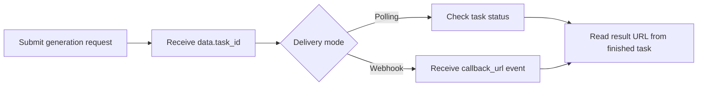

# Seedream 4.5 API with APIDot

Build with the Seedream 4.5 API using APIDot: cURL, Node.js, polling, webhooks, pricing, and fal.ai comparison in one production-oriented GitHub repo.

[Get API Key](https://apidot.ai/dashboard/api-key) | [API Docs](https://apidot.ai/docs/seedream-4-5) | [Model Page](https://apidot.ai/models/seedream-4-5) | [Main Examples](https://github.com/APIDotAI/apidot-examples)

## Overview

Seedream 4.5, also styled as SeeDream 4.5, is ByteDance Seed's upgraded image generation and editing model after Seedream 4.0. It is positioned for teams that need text-to-image generation, image-to-image workflows, and natural-language editing to produce more polished visual assets from the same model family.

Seedream 4.5 is the stronger choice when final image quality, readable text, subject consistency, and reference-guided control matter more than rough draft speed alone. It fits ecommerce hero shots, ad posters, brand assets, coherent visual sets, and edits where preserving product shape, identity, lighting, or layout can reduce post-production work.

APIDot exposes `seedream-4.5` and `seedream-4.5-edit` through one async submit flow. Send `input.prompt`, choose `input.size` and `input.n`, add up to 10 `input.image_urls` for edit mode, then store the returned `task_id` and retrieve results through polling or `callback_url`. Each successful output costs 5 APIDot credits, and edit requests must keep reference images plus requested outputs at 15 or fewer.

## Capabilities

- Rendering 4K-ready detail for final assets: Seedream 4.5 produces 2K or 4K visuals with cleaner texture, lighting, material, and scene structure, helping product and campaign images hold up beyond early concept review.
- Generating readable text inside designed images: Use it for posters, labels, signage, and information graphics where text needs to be legible enough for review, localization, or downstream layout work.
- Following natural-language prompts with fewer corrections: Seedream 4.5 handles subject, composition, lighting, style, and output intent in one prompt, reducing the need to rebuild visual direction across repeated attempts.
- Preserving products and characters across variations: The model is useful when people, products, outfits, poses, or brand cues need to stay recognizable across edited images, angle changes, and image series.
- Editing source images with reference-guided control: `seedream-4.5-edit` accepts up to 10 reference images for product retouching, background changes, material updates, style transfer, and controlled scene recomposition.
- Producing batches with flexible size controls: Choose `2K`, `4K`, ratio presets, custom `WIDTHxHEIGHT`, or `{ width, height }`, and request 1 to 15 outputs with `input.n` for candidate review.

## Common use cases

Seedream 4.5 is suited to teams that need image generation and controlled editing to move closer to final delivery, especially when visual polish, readable text, and reference consistency affect whether an asset can ship.

- Ecommerce hero product visuals
- Ad posters with readable copy
- Brand and IP image sets
- Product background and material edits
- Teaching diagrams and infographics
- Social campaign final candidates

## Pricing on APIDot

Catalog price: $0.025 / generation.
Pricing snapshot: per generation | 2K/4K text-to-image or image editing: 5 credits ($0.025)

This README uses the pricing data currently published in the APIDot model catalog. Check the APIDot model page before high-volume production runs.

### Model-specific pricing

- seedream-4.5: per generation | 2K/4K text-to-image: 5 credits ($0.025)
- seedream-4.5-edit: per generation | 2K/4K image editing: 5 credits ($0.025)

## APIDot vs fal.ai

For tiers with fal.ai comparison data in the APIDot catalog, APIDot shows up to 38% lower listed price. Treat this as a catalog snapshot and verify current pricing before launch.

| Tier | APIDot listed price | fal.ai listed price | Note |
| --- | ---: | ---: | --- |
| text-to-image \| 2K/4K | $0.025 | $0.04 | APIDot is 38% lower in this tier |
| image editing \| 2K/4K | $0.025 | $0.04 | APIDot is 38% lower in this tier |

## Quick start

    cp .env.example .env
    # Edit .env and set APIDOT_API_KEY
    cd node
    npm start

The same request shape is available as a copy-paste cURL example in curl/generate.md.

## API workflow



Use polling for local tests and webhook delivery for production queues. Store `data.task_id` before the first status check so retries, callbacks, and result URLs can be reconciled safely.

## Minimal API request

Submit to APIDot's unified async generation endpoint:

    POST https://api.apidot.ai/api/generate/submit
    Authorization: Bearer <APIDOT_API_KEY>
    Content-Type: application/json

Primary payload:

```json
{
  "model": "seedream-4.5",
  "callback_url": "https://your-domain.com/callback",
  "input": {
    "prompt": "A premium product campaign image of a matte ceramic mug on a warm gray studio background, precise typography on the mug reading APIDot, soft window light, balanced shadows, 4K commercial photography style.",
    "size": "16:9",
    "n": 1
  }
}
```

Generate or edit images with Seedream 4.5 through APIDot's unified async submit endpoint.

Seedream 4.5 is available on APIDot as `seedream-4.5` for prompt-only image generation and `seedream-4.5-edit` for reference-guided editing. Every request requires `input.prompt`. Optional shared controls are `input.size` and `input.n`; edit mode also requires `input.image_urls`. Submit requests asynchronously, store `task_id`, then poll the status endpoint or receive terminal delivery through `callback_url`.

## Model IDs and request variants

### seedream-4.5

```json
{
  "model": "seedream-4.5",
  "callback_url": "https://your-domain.com/callback",
  "input": {
    "prompt": "A premium product campaign image of a matte ceramic mug on a warm gray studio background, precise typography on the mug reading APIDot, soft window light, balanced shadows, 4K commercial photography style.",
    "size": "16:9",
    "n": 1
  }
}
```

### seedream-4.5-edit

```json
{
  "model": "seedream-4.5-edit",
  "callback_url": "https://your-domain.com/callback",
  "input": {
    "prompt": "Keep the product shape and label from the source image. Replace the background with a clean winter studio setup, preserve realistic shadows, and make the final image suitable for an ecommerce hero asset.",
    "image_urls": [
      "https://your-domain.com/source-image.png"
    ],
    "size": "2K",
    "n": 1
  }
}
```

### custom size object

```json
{
  "model": "seedream-4.5",
  "callback_url": "https://your-domain.com/callback",
  "input": {
    "prompt": "A fashion editorial portrait in a studio with clean typography and refined lighting.",
    "size": {
      "width": 2304,
      "height": 3072
    },
    "n": 1
  }
}
```

## Request parameters

| Field | Type | Required | Description |
| --- | --- | --- | --- |
| model | string | yes | Target model id. Use `seedream-4.5` for prompt-only generation or `seedream-4.5-edit` for reference-guided editing. |
| callback_url | string | no | Optional webhook URL for terminal task updates. |
| input | object | yes | Container for Seedream 4.5 parameters. |
| input.prompt | string | yes | Generation or editing instruction. Empty prompts are rejected. |
| input.size | string | object | no | Output size. Supported values: `2K`, `4K`, `1:1`, `3:4`, `4:3`, `16:9`, `9:16`, `3:2`, `2:3`, `21:9`, custom `WIDTHxHEIGHT`, or `{ "width": 2304, "height": 3072 }`. |
| input.n | integer | no | Number of output images. Supported range: 1 to 15. |
| input.image_urls | string[] | no | Reference image URLs. Required for `seedream-4.5-edit`, unsupported for `seedream-4.5`; maximum 10 URLs. For edit requests, `image_urls.length + n` must not exceed 15. |

## Practical integration notes

- Use `seedream-4.5` for prompt-only generation and do not send `input.image_urls` with this model id.
- Use `seedream-4.5-edit` when the request depends on source or reference images, and provide 1 to 10 `input.image_urls` entries.
- Keep `input.image_urls.length + input.n` at 15 or fewer for edit requests.
- Use ratio presets for common social and product formats, and use custom `WIDTHxHEIGHT` or `{ width, height }` only when the workflow needs exact dimensions.
- Store the returned `task_id` immediately so polling, retries, and callbacks remain idempotent.

## Polling and webhooks

APIDot media generation is asynchronous. Store data.task_id immediately after submit, poll /api/generate/status/{task_id} for local tests, and use callback_url webhooks for production queues where users may leave the page before completion.

Webhook handlers should verify task ownership, persist callback events, return 2xx quickly, and be idempotent because duplicate deliveries can happen.

## Response and errors

- code: HTTP-style status code. Successful submits return `200`.
- data.task_id: Async task identifier returned immediately after submission.
- data.status: Initial task status, typically `not_started`.
- data.created_time: Task creation timestamp.

Common error classes:

- 400 invalid_request: Missing prompt, invalid size, invalid `n`, missing `image_urls` for `seedream-4.5-edit`, unsupported `image_urls` for `seedream-4.5`, too many reference images, or more than 15 total input and output images.
- 401 authentication_error: Missing, expired, or invalid Bearer API key.
- 402 insufficient_credits: The current prepaid balance cannot cover the requested image count.
- 429 rate_limited: The API key is temporarily above the allowed submit rate.

## Production notes

- Keep APIDot API keys in server-side environment variables.
- Persist task_id, selected model, request payload, user ID, and status together.
- Use a moderate polling interval for tests and webhooks for durable production callbacks.
- Validate source media URLs before submitting requests that depend on source files.
- Avoid logging API keys, private prompts, private media URLs, or callback URLs.
- Retry transient network failures with backoff, but do not retry unchanged invalid payloads.

## FAQ

### What is Seedream 4.5 on APIDot, and when should I use it?

Seedream 4.5 is ByteDance Seed's upgraded image generation and editing model for higher-fidelity production images. Use it when 2K or 4K output, readable text, subject consistency, and reference-guided editing matter more than quick low-stakes prompt exploration.

### When should I choose Seedream 4.5 instead of a lighter image workflow?

Choose Seedream 4.5 when the output needs to be close to a usable product image, poster, brand visual, or edited asset. A lighter or faster workflow is usually better for early idea exploration, but Seedream 4.5 is better when fewer cleanup passes and stronger final detail matter.

### How should I choose between `seedream-4.5` and `seedream-4.5-edit`?

Use `seedream-4.5` when the request starts from a prompt only. Use `seedream-4.5-edit` when the task depends on source images, product references, characters, style references, or multi-image composition.

### Which inputs are required for Seedream 4.5 API?

Both variants require `input.prompt`. You can also send `input.size` and `input.n`; edit mode additionally requires `input.image_urls` with at least one reachable image URL.

### Which size values does Seedream 4.5 support?

`input.size` supports `2K`, `4K`, ratio presets `1:1`, `3:4`, `4:3`, `16:9`, `9:16`, `3:2`, `2:3`, `21:9`, custom `WIDTHxHEIGHT`, and custom objects such as `{ "width": 2304, "height": 3072 }`.

### How many outputs and reference images can one request use?

`input.n` supports 1 to 15 outputs. For `seedream-4.5-edit`, APIDot accepts up to 10 reference images, and reference images plus requested outputs must stay at 15 or fewer.

### How do pricing and result delivery work?

Seedream 4.5 costs 5 APIDot credits, or $0.025, per successful output. Submit the task, store the returned `task_id`, then retrieve results through status polling or receive the terminal result through `callback_url`.

### Which fields or assumptions should I avoid with Seedream 4.5?

Do not assume unrelated image-model fields are supported. This page documents `prompt`, `size`, `n`, edit-only `image_urls`, and optional `callback_url`; avoid fields such as `seed`, `resolution`, `output_format`, or `elements` unless the API docs add them.

### Which model id should I send?

Use `seedream-4.5` for prompt-only generation and `seedream-4.5-edit` for reference-guided editing.

### Can `seedream-4.5` accept `image_urls`?

No. Send `input.image_urls` only with `seedream-4.5-edit`; the edit variant requires at least one reference image.

### Which size values are supported?

`input.size` supports `2K`, `4K`, ratio presets, custom `WIDTHxHEIGHT`, and custom objects such as `{ "width": 2304, "height": 3072 }`.

### Is APIDot the creator of the underlying model?

No. This is an APIDot integration repository for calling Seedream 4.5 through APIDot. ByteDance Seed is listed as the model provider in the APIDot catalog. Use the APIDot model page for current availability, pricing, and usage terms.

## Related links

- APIDot: https://apidot.ai
- Seedream 4.5 model page: https://apidot.ai/models/seedream-4-5
- Seedream 4.5 API docs: https://apidot.ai/docs/seedream-4-5
- APIDot quickstart: https://apidot.ai/docs/quickstart
- APIDot webhooks: https://apidot.ai/docs/webhooks
- Main APIDot examples repo: https://github.com/APIDotAI/apidot-examples

## Related APIDot model API repositories

More image API examples from APIDot:

| Model | Repository |
| --- | --- |
| GPT Image 2 | [gpt-image-2-api](https://github.com/APIDotAI/gpt-image-2-api) |
| Nano Banana 2 | [nano-banana-2-api](https://github.com/APIDotAI/nano-banana-2-api) |
| Nano Banana Pro | [nano-banana-pro-api](https://github.com/APIDotAI/nano-banana-pro-api) |


